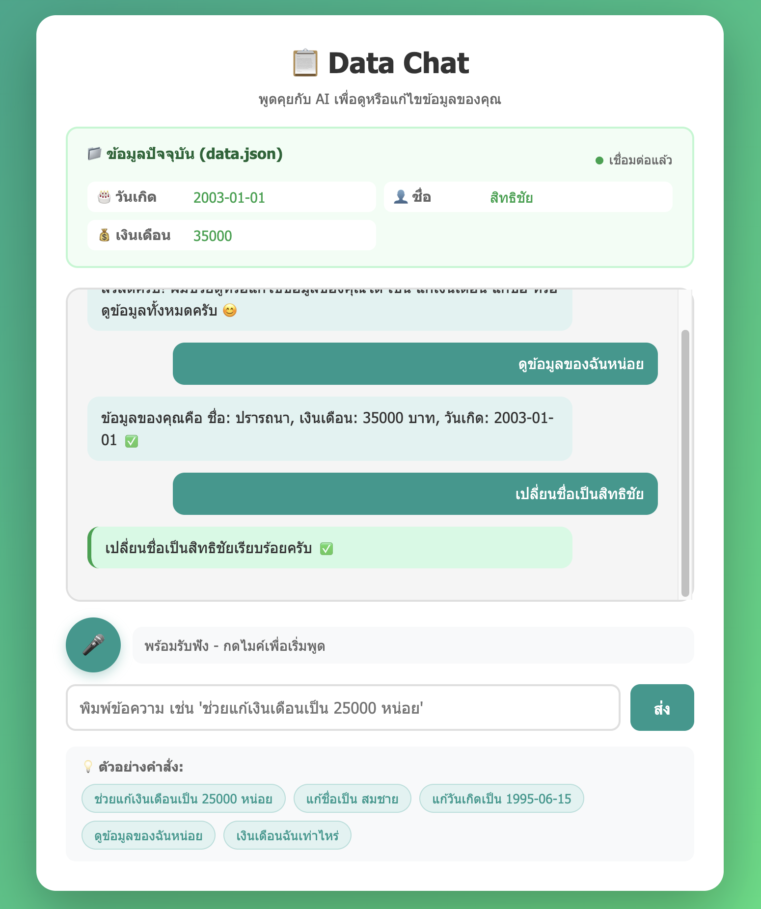

# 🎤 Thai Voice Chat AI

Thai Voice Chat application powered by **Gemini 2.0 Flash** API — supporting voice/text chat, text-to-speech, and AI-powered data editing.

---

## ✨ Features

| Feature | Description |
|---------|-------------|
| 🎤 **Voice Chat** | Speak Thai and get AI responses in both text and audio |
| ⌨️ **Text Chat** | Type messages and interact with AI |
| 🔊 **Text-to-Speech** | AI reads responses aloud via Web Speech API |
|  **Data Chat** | Chat with AI to view/edit `data.json` using natural language |
| 📱 **Responsive** | Works on mobile and desktop browsers |

---

## 📸 Screenshots



---

## 📁 Project Structure

```
voice-chat-ai/
├── index.html              # Frontend Only — voice chat (API key in browser)
├── index-backend.html      # Backend version — voice chat (API key on server)
├── index-data-chat.html    # Data Chat — view/edit data.json via AI
│
├── app-data-chat.js        # Data Chat frontend logic
│
├── backend/
│   ├── app.py              # Flask API server (port 4000)
│   ├── requirements.txt    # Python dependencies
│   ├── .env.template       # Environment variable template
│   └── .env                # Your API keys (do NOT commit)
│
├── data.json               # Sample data for Data Chat feature
├── run.sh                  # Startup script (macOS / Linux)
├── run.bat                 # Startup script (Windows)
├── package.json            # Node.js metadata
│
├── QUICKSTART.md           # Detailed quick-start guide
├── DEPLOYMENT.md           # Production deployment guide
└── PROJECT_SUMMARY.md      # Full project summary
```

---

## 🔑 Prepare API Keys

### 1. Gemini API Key (Required)

1. Go to [Google AI Studio](https://makersuite.google.com/app/apikey)
2. Sign in with your Google account
3. Click **"Create API Key"**
4. Copy the key

---

## 🚀 Quick Start

### Option A: Frontend Only (No backend required)

Best for quick testing — API key is stored in your browser.

```bash
# macOS
open index-data-chat.html

# Windows
start index-data-chat.html

# Linux
xdg-open index-data-chat.html
```

Then paste your **Gemini API Key** in the settings field on the page.

---

### Option B: Backend Mode (Recommended)

API keys stay on the server. Supports Data Chat.

#### Step 1 — Clone & Setup

```bash
cd voice-chat-ai

# Create Python virtual environment
python3 -m venv .venv

# Activate it
# macOS / Linux:
source .venv/bin/activate
# Windows:
.venv\Scripts\activate

# Install dependencies
pip install -r backend/requirements.txt
```

#### Step 2 — Configure API Keys

```bash
# Copy the template
cp backend/.env.template backend/.env
```

Edit `backend/.env` and fill in your keys:

```env
GEMINI_API_KEY=your_gemini_api_key_here
```

#### Step 3 — Start the Backend

```bash
cd backend
python app.py
```

Backend will run at **http://localhost:4000**

#### Step 4 — Serve the Frontend

Open a **new terminal**:

```bash
# From the project root
python3 -m http.server 8000
```

Open your browser:

| Page | URL |
|------|-----|
| Voice Chat (backend) | http://localhost:8000/index-backend.html |
| Data Chat | http://localhost:8000/index-data-chat.html |

---

### Option C: Use the Run Script

```bash
# macOS / Linux
chmod +x run.sh
./run.sh

# Windows
run.bat
```

The script will prompt you to choose between Frontend-only or Backend mode.

---

## 🌐 API Endpoints

The Flask backend (`backend/app.py`) exposes:

| Method | Endpoint | Description |
|--------|----------|-------------|
| `GET` | `/api/health` | Health check — shows configured status |
| `POST` | `/api/chat` | Send a message, get AI response |
| `GET` | `/api/data` | Get current `data.json` content |
| `POST` | `/api/data-chat` | Chat with AI to view/edit `data.json` |

### Example — Chat Request

```bash
curl -X POST http://localhost:4000/api/chat \
  -H "Content-Type: application/json" \
  -d '{"message": "สวัสดีครับ"}'
```

### Example — Health Check

```bash
curl http://localhost:4000/api/health
```

---

## 📋 System Requirements

- **Python 3.8+** (for backend)
- **Browser**: Chrome or Edge recommended
- **Microphone** for voice chat
- **Internet** connection

### Python Dependencies

```
Flask==3.0.0
flask-cors==4.0.0
requests==2.31.0
python-dotenv==1.0.0
```

---

## 🔒 Security Notes

- **Frontend Only**: API key in `localStorage` — for testing/personal use only
- **Backend Mode**: API key in `.env` server-side — suitable for production
- `.env` is listed in `.gitignore` — never committed to Git
- No conversation data is stored permanently

---

## 💰 Gemini API Free Tier

| Limit | Value |
|-------|-------|
| Requests / minute | 15 |
| Requests / day | 1,500 |

Sufficient for personal use and prototyping. See [pricing](https://ai.google.dev/pricing) for paid plans.

---

## 📝 License

MIT License — free to use and modify.
